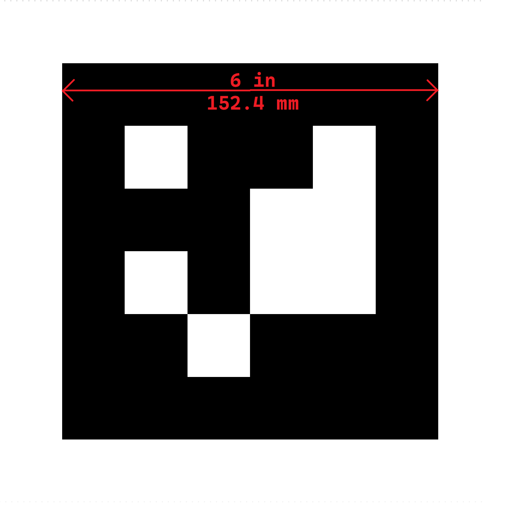

# AprilTag detection in ros2
This Repository is about the AprilTag ros2 detection in ros2 humble
from [Christian Rauch](https://github.com/christianrauch/apriltag_ros/tree/master).

For further informations check his repo.

## Getting started

1. Build the image 
```bash
docker compose -f docker/build.yml build
```
2. Run the apriltag detction
*Hint: Adjust the camera_info and the image_topic and the params path in the docker compose*

```bash
docker compose -f docker/docker-compose.yml up
```

## Run the Apriltag Detection
The general command is: 
```bash
ros2 run apriltag_ros apriltag_node --ros-args -r image_rect:=/zed2i/zed_node/rgb_raw/image_raw_color -r camera_info:=/zed2i/zed_node/rgb_raw/camera_info --params-file `ros2 pkg prefix apriltag_ros`/share/apriltag_ros/cfg/tags_36h11.yaml
```

- **image_rect**: The image_rect param is the image topic
- **camera_info**: The camera_info param is the camera info topic
- **params_file**: The params_file param is the path to the param file

### Published topics 
`/tf (type: tf2_msgs/msg/TFMessage)`

`/detections (type: apriltag_msgs/msg/AprilTagDetectionArray)`


## Setting params
The tag size and other params can be set into the param file under the directory `configs`
There are 2 files as example, the `tags_36h11.yaml` and the `tags_36h11_custom.yaml`.
In the `tags_36h11_custom.yaml` file, specific tags who has to be detected can be defined and the frame can be renamed for every tag.
In the `tags_36h11.yaml` all tags of the family 36h11 can be detected. 

To change the tag family, just create another file and change the tag family in the config

Example with `Circle21h7` family
```yaml
 ros__parameters:
        image_transport: raw    # image format
        family: Circle21h7           # tag family name
        size: 0.12             # tag edge size in meter
        max_hamming: 0          # maximum allowed hamming distance (corrected bits)
```


### About the tag-size

For a good pose-estimation of the tags it`s very important to set the tag-size really precise.
As usual the tag-size is the size of the tag into the black border in meter. See an example here.



## Author

Samuel Hafner (@hafners)
